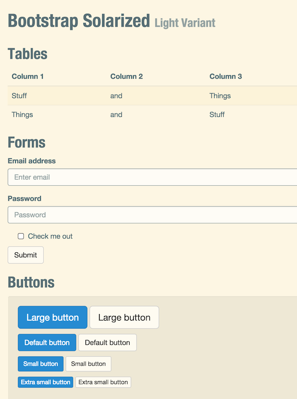
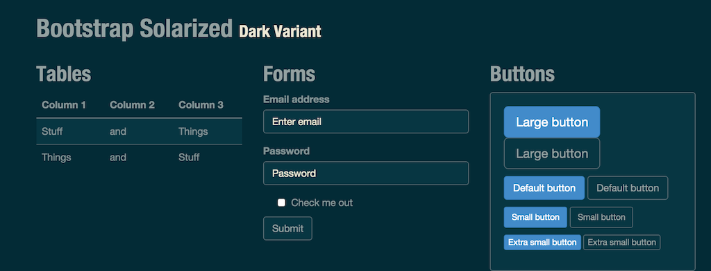

# bootstrap-solarized

A pair of CSS themes for [Bootstrap 3](http://getbootstrap.com/) based
on Ethan Schoonover's
[solarized](http://ethanschoonover.com/solarized).  Initially created
with [bootstrap-magic](http://pikock.github.io/bootstrap-magic).

This package is
[available on npm](https://www.npmjs.com/package/bootstrap-solarized). To
install via npm:

```
npm install bootstrap-solarized
```

## Screenshots

 
